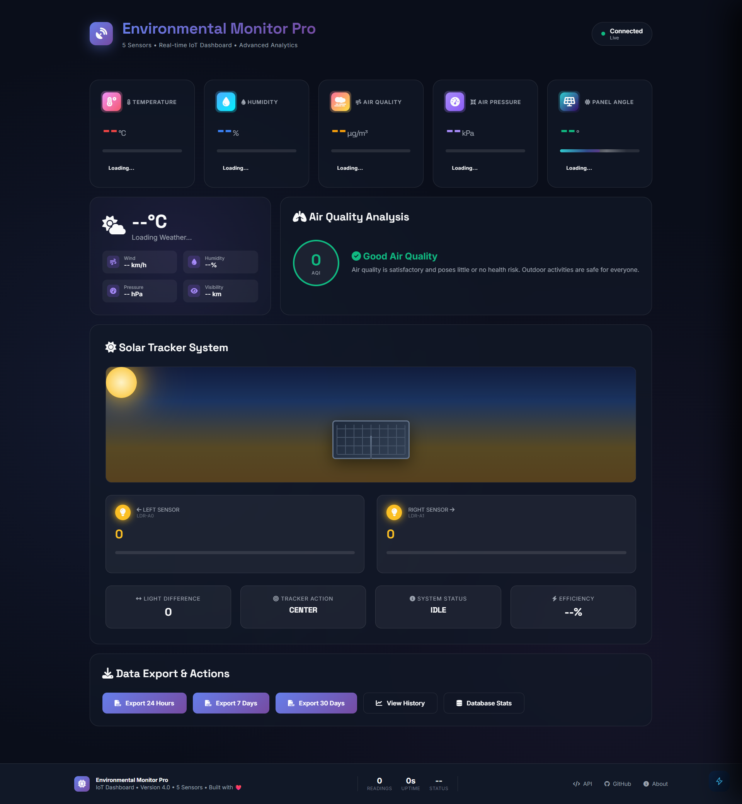

# 🌍 Environmental Monitor Pro — 5-Sensor IoT Dashboard with AI Analyst

> A full-stack IoT environmental monitoring system — from bare Arduino sensors to a real-time AI-powered web dashboard. Built entirely from scratch without any IoT frameworks or cloud platforms.



---

## 📖 Table of Contents

- [The Idea](#-the-idea)
- [System Overview](#-system-overview)
- [Hardware](#-hardware)
  - [Components List](#components-list)
  - [Sensor Deep Dives](#sensor-deep-dives)
  - [Wiring Diagrams](#wiring-diagrams)
- [Arduino Firmware](#-arduino-firmware)
- [Backend — Flask Server](#-backend--flask-server)
- [Frontend — Dashboard](#-frontend--dashboard)
- [AI Chatbot — Ollama](#-ai-chatbot--ollama)
- [Alert Engine](#-alert-engine)
- [Data Flow](#-data-flow)
- [Installation & Setup](#-installation--setup)
- [API Reference](#-api-reference)
- [Project Structure](#-project-structure)
- [Tech Stack](#-tech-stack)

---

## 💡 The Idea

The project started with a simple question: **can a $5 Arduino and a handful of cheap sensors replace a professional environmental monitoring station?**

Living in Muscat, Oman — one of the hottest cities on Earth — environmental conditions matter enormously. Summer temperatures regularly exceed 45°C. Dust storms are common. Humidity swings from bone-dry desert to oppressively humid coastal air overnight.

The goal was to build a system that could:

1. **Monitor** temperature, humidity, dust/air quality, atmospheric pressure, and solar intensity in real time
2. **Visualize** everything in a beautiful live dashboard accessible from any browser on the local network
3. **Alert** when readings cross dangerous thresholds
4. **Analyze** patterns using a locally-running AI that understands the sensor context

No cloud. No subscription. No API keys. Everything runs on a single laptop.

---

## 🏗 System Overview

```
┌─────────────────────────────────────────────────────────┐
│                     HARDWARE LAYER                      │
│                                                         │
│  DHT11 ──┐                                              │
│  Dust ───┤                                              │
│  Pressure┤──► Arduino Uno ──► USB Serial (9600 baud)   │
│  LDR×2 ──┤                                              │
│  Servo ──┘                                              │
└─────────────────────────────┬───────────────────────────┘
                              │ JSON every 2 seconds
                              ▼
┌─────────────────────────────────────────────────────────┐
│                     BACKEND LAYER                       │
│                                                         │
│  pyserial reads JSON ──► Flask parses & stores          │
│                    ──► SQLite (sensor_data.db)          │
│                    ──► REST API endpoints               │
│                    ──► Open-Meteo weather fetch         │
└─────────────────────────────┬───────────────────────────┘
                              │ HTTP / REST
                              ▼
┌─────────────────────────────────────────────────────────┐
│                    FRONTEND LAYER                       │
│                                                         │
│  dashboard.html polls /api/data every 2s               │
│  Renders: 5 sensor cards, solar tracker viz,           │
│  weather widget, AQI panel, alert engine               │
│                    ──► AI Sidebar                       │
│                         fetches 3 APIs                  │
│                         builds context prompt           │
│                         streams Ollama response         │
└─────────────────────────────────────────────────────────┘
```

---

## 🔧 Hardware

### Components List

| Component | Model | Purpose | Price (approx) |
|-----------|-------|---------|----------------|
| Microcontroller | Arduino Uno R3 | Brain — reads all sensors, sends JSON | $4 |
| Temp + Humidity | DHT11 | Temperature (0–50°C) and humidity (20–80%) | $1.50 |
| Dust / Air Quality | Sharp GP2Y1014AU0F | PM2.5 particulate density in µg/m³ | $4 |
| Pressure | MPS20N0040D + HX710B | Differential pressure 0–40 kPa | $3 |
| Light sensors | LDR × 2 (photoresistor) | Detect sun direction for solar tracking | $0.30 |
| Servo motor | SG90 9g | Rotates solar panel 30°–150° | $2 |
| Solar panel | Small 5V panel | The thing being tracked (demo) | $3 |
| Resistors | 10kΩ × 2, 150Ω × 1 | Pull-downs for LDRs, current limit for dust LED | $0.10 |
| Jumper wires | — | Connections | $1 |
| Breadboard | — | Prototyping | $1.50 |

**Total: ~$20**

---

### Sensor Deep Dives

#### 🌡 DHT11 — Temperature & Humidity

The DHT11 uses a single-wire protocol. It contains a capacitive humidity sensor and a thermistor. The Arduino sends a start signal, and the DHT11 responds with 40 bits of data: 16 bits humidity, 16 bits temperature, 8 bits checksum.

**Limitations to know:**
- Accuracy: ±2°C temperature, ±5% humidity — acceptable for environmental monitoring
- Minimum sampling interval: 1 second (we sample every 2s, safe)
- Range: 0–50°C temp, 20–90% humidity. In Muscat this means during peak summer (48°C+) the sensor saturates — readings cap at 50°C

**Pin connection:**
```
DHT11 VCC  → Arduino 5V
DHT11 DATA → Arduino Pin 2 (with 10kΩ pull-up to 5V)
DHT11 GND  → Arduino GND
```

---

#### 💨 Sharp GP2Y1014AU0F — Dust / PM2.5

This is an optical sensor. Inside, an infrared LED illuminates a measurement chamber, and a phototransistor measures how much light scatters off dust particles. More dust = more scatter = higher voltage output.

The LED must be pulsed (not left on) to avoid drift and heat buildup. The Arduino fires the LED for exactly 280µs, waits 40µs, takes an analog reading, then turns the LED off. This cycle produces a voltage that maps to dust concentration.

**Voltage → µg/m³ conversion:**
```
voltage = (reading / 1024.0) * 5.0
dust_µg = (voltage - 0.6) / 0.005
if dust_µg < 0: dust_µg = 0
```

The 0.6V offset is the zero-dust baseline voltage. The 0.005 is the sensitivity (5mV per µg/m³).

**WHO air quality reference:**
- Safe: < 15 µg/m³ (annual mean)
- Moderate: 15–35 µg/m³
- Unhealthy: 35–150 µg/m³
- Sandstorm (Muscat): often > 200 µg/m³

**Pin connection:**
```
GP2Y1014 Pin 1 (V-LED) → 150Ω resistor → Arduino 5V
GP2Y1014 Pin 2 (LED-GND) → Arduino GND
GP2Y1014 Pin 3 (LED control) → Arduino Pin 7
GP2Y1014 Pin 4 (GND) → Arduino GND
GP2Y1014 Pin 5 (Vo / signal out) → Arduino A2
GP2Y1014 Pin 6 (VCC) → Arduino 5V
```

> ⚠️ The 150Ω resistor on the LED line is critical. Without it you'll burn out the LED within hours.

---

#### 📊 MPS20N0040D + HX710B — Differential Pressure

The MPS20N0040D is a piezoresistive MEMS pressure sensor in a small brass housing. It measures **differential pressure** — the difference between two ports — from 0 to 40 kPa. It does NOT measure atmospheric pressure (which is ~101 kPa).

The HX710B is a 24-bit ADC (analog-to-digital converter) with a built-in amplifier, specifically designed for bridge sensors like this one. It communicates via a simple 2-wire serial protocol (similar to SPI but simpler).

**Important:** Because this is a differential sensor, readings near 0 kPa mean the two ports have equal pressure. Readings near 40 kPa mean there's a large pressure difference between them. The sensor is useful for measuring airflow, filter clogging, or liquid levels.

**Reading the HX710B:**
```cpp
// Clock one bit from HX710B
boolean readBit() {
    digitalWrite(HX_SCK, HIGH);
    delayMicroseconds(1);
    boolean bit = digitalRead(HX_DOUT);
    digitalWrite(HX_SCK, LOW);
    return bit;
}

// Read full 24-bit value
long readRaw() {
    long value = 0;
    for (int i = 0; i < 24; i++) {
        value = (value << 1) | readBit();
    }
    // Extra clock pulse to set gain for next read
    digitalWrite(HX_SCK, HIGH);
    delayMicroseconds(1);
    digitalWrite(HX_SCK, LOW);
    return value;
}
```

**Pin connection:**
```
HX710B VCC  → Arduino 5V
HX710B GND  → Arduino GND
HX710B DOUT → Arduino Pin 12
HX710B SCK  → Arduino Pin 11
HX710B A+   → MPS20N0040D + port
HX710B A-   → MPS20N0040D - port
```

---

#### ☀️ Dual LDR + SG90 Servo — Solar Tracker

Two LDRs (light-dependent resistors) are mounted on either side of a divider on top of the solar panel. The principle is simple: whichever LDR receives more light, that's the direction the sun is coming from, so the servo rotates the panel toward it.

**LDR voltage divider circuit:**
```
5V ──── LDR ──┬── A0 (left reading)
              │
             10kΩ
              │
             GND
```

The analog reading (0–1023) maps inversely to brightness. A bright LDR reads LOW (resistance drops). A shaded LDR reads HIGH.

**Tracking logic:**
```cpp
int ldrLeft  = analogRead(A0);   // Left sensor
int ldrRight = analogRead(A1);   // Right sensor
int diff = ldrLeft - ldrRight;

if (abs(diff) > THRESHOLD) {     // THRESHOLD = 50 (ignore tiny differences)
    if (diff > 0) {
        // Left side darker → sun is on the right → move right
        angle = min(angle + STEP, MAX_ANGLE);
    } else {
        // Right side darker → sun is on the left → move left
        angle = max(angle - STEP, MIN_ANGLE);
    }
    servo.write(angle);
    status = "TRACKING";
} else {
    status = "CENTERED";
}
```

Range: 30° (full left) to 150° (full right), center at 90°.

**Pin connection:**
```
LDR Left  → Arduino A0 (with 10kΩ pull-down to GND)
LDR Right → Arduino A1 (with 10kΩ pull-down to GND)
Servo signal → Arduino Pin 9
Servo VCC → Arduino 5V
Servo GND → Arduino GND
```

> ⚠️ The SG90 servo can draw up to 250mA under load. If powering multiple servos or sensors from the Arduino's 5V pin, consider an external 5V supply to avoid brownouts.

---

### Wiring Diagrams

#### Full System Pinout

```
Arduino Uno
┌─────────────────────┐
│  Pin 2  ────────────┼──► DHT11 DATA
│  Pin 7  ────────────┼──► Sharp GP2Y LED control
│  Pin 9  ────────────┼──► SG90 Servo signal
│  Pin 11 ────────────┼──► HX710B SCK
│  Pin 12 ────────────┼──► HX710B DOUT
│  A0     ────────────┼──► LDR Left (with 10kΩ to GND)
│  A1     ────────────┼──► LDR Right (with 10kΩ to GND)
│  A2     ────────────┼──► Sharp GP2Y signal output (Vo)
│  5V     ────────────┼──► DHT11 VCC, GP2Y VCC, HX710B VCC, Servos
│  GND    ────────────┼──► All component GNDs
└─────────────────────┘
```

---

## 💻 Arduino Firmware

The Arduino runs a single loop that:
1. Reads all sensors
2. Runs the solar tracker logic
3. Assembles a JSON string
4. Prints it to Serial at 9600 baud

**Output JSON format (every 2 seconds):**
```json
{
  "temperature": 38.2,
  "humidity": 45,
  "dust": 67.3,
  "pressure": 18.4,
  "connected": true,
  "tracker": {
    "angle": 95,
    "ldr_left": 512,
    "ldr_right": 498,
    "diff": 14,
    "action": "CENTER",
    "status": "CENTERED"
  }
}
```

The JSON is assembled manually (no library) to keep memory usage low. The Arduino Uno has only 2KB of RAM — JSON libraries can consume 30–40% of that.

---

## 🐍 Backend — Flask Server

`server.py` is the bridge between the Arduino and the browser. It runs three concurrent jobs:

### 1. Serial Reader Thread

Runs in a background thread so it never blocks the web server:

```python
def read_serial():
    while True:
        if ser.in_waiting:
            line = ser.readline().decode('utf-8').strip()
            data = json.loads(line)
            store_to_db(data)
            update_global_state(data)
        time.sleep(0.1)
```

### 2. SQLite Storage

Every reading is stored with a timestamp:

```sql
CREATE TABLE sensor_data (
    id INTEGER PRIMARY KEY AUTOINCREMENT,
    timestamp DATETIME DEFAULT CURRENT_TIMESTAMP,
    temperature REAL,
    humidity REAL,
    dust REAL,
    pressure REAL,
    solar_angle INTEGER,
    ldr_left INTEGER,
    ldr_right INTEGER
);
```

Data accumulates indefinitely. On a 2-second interval, that's ~43,200 rows per day, ~315MB per year — manageable with SQLite.

### 3. REST API Endpoints

| Method | Endpoint | Returns |
|--------|----------|---------|
| GET | `/api/data` | Latest sensor reading (JSON) |
| GET | `/api/history/<hours>` | Last N hours of readings |
| GET | `/api/alerts/<count>` | Last N fired alerts |
| GET | `/api/weather` | Muscat weather from Open-Meteo |
| GET | `/api/export/csv/<days>` | Download CSV of last N days |
| GET | `/api/db/stats` | Database statistics |

### 4. Weather Integration

Uses the [Open-Meteo](https://open-meteo.com/) free API — no key required, no rate limits for personal use:

```python
# Muscat, Oman coordinates
LAT, LON = 23.5880, 58.3829

url = f"https://api.open-meteo.com/v1/forecast?latitude={LAT}&longitude={LON}&current_weather=true&hourly=relativehumidity_2m,apparent_temperature,precipitation_probability,windspeed_10m,visibility"
```

Weather is cached for 10 minutes to avoid hammering the free API.

---

## 🌐 Frontend — Dashboard

`dashboard.html` is a **single self-contained HTML file** — no build tools, no npm, no webpack. Open it in a browser pointed at the Flask server and it works.

### Why a single file?

- Zero deployment complexity
- Works offline once loaded (cached fonts aside)
- Easy to share — just send the file
- No dependency hell

### Architecture

```
dashboard.html
├── <head>
│   ├── Google Fonts (Space Grotesk + Inter)
│   └── Font Awesome 6 (icons)
├── <style>
│   ├── CSS custom properties (:root variables)
│   ├── Card layouts (CSS Grid — 15-column system)
│   ├── Animations (keyframes for all transitions)
│   └── AI sidebar styles
├── <body>
│   ├── Header (logo, status pill)
│   ├── Dashboard Grid
│   │   ├── 5 sensor cards
│   │   ├── Weather widget
│   │   ├── AQI analysis panel
│   │   ├── Solar tracker visualization
│   │   └── Export panel
│   ├── Footer
│   ├── AI Sidebar (FAB + panel)
│   └── <script>
│       ├── updateData() — polls /api/data every 2s
│       ├── updateWeather() — polls /api/weather every 10min
│       ├── updateSolarVisualization() — CSS 3D transforms
│       └── AI chatbot logic (Ollama streaming)
```

### CSS Grid Layout

The dashboard uses a 15-column grid. Each sensor card spans 3 columns (5 cards × 3 = 15). This gives perfect equal distribution on wide screens and collapses gracefully on mobile:

```css
.dashboard-grid {
    display: grid;
    grid-template-columns: repeat(15, 1fr);
    gap: 1.5rem;
}

.sensor-card { grid-column: span 3; }  /* 5 cards = full width */
.weather-widget { grid-column: span 5; }
.air-quality-panel { grid-column: span 10; }
.solar-tracker-panel { grid-column: span 15; }
```

### No Layout Shift

A key UX challenge: sensor values update every 2 seconds, and different values have different character widths (`8` vs `38.5` vs `100`). Without fixed heights, the cards would jump and the grid would reflow constantly.

Fix: lock the heights before values load:
```css
.sensor-card    { min-height: 210px; }
.card-value     { min-height: 3.2rem; display: flex; align-items: baseline; }
.status-badge   { min-height: 2.1rem; min-width: 110px; white-space: nowrap; }
```

Status color changes transition smoothly:
```css
.status-badge {
    transition: background 0.5s ease, color 0.5s ease;
}
```

---

## 🤖 AI Chatbot — Ollama

The AI assistant runs 100% locally using [Ollama](https://ollama.com). No internet required after initial model download, no API keys, no cost.

### Why Ollama?

| | Ollama (local) | Cloud API |
|---|---|---|
| Cost | Free forever | Pay per token |
| Privacy | Data never leaves your machine | Sent to external servers |
| Latency | Depends on hardware | Usually fast |
| Offline | ✅ Works offline | ❌ Needs internet |
| Setup | One command | Account + billing |

### Recommended Models

| Model | Size | CPU Speed | Quality |
|-------|------|-----------|---------|
| `qwen2.5:0.5b` | 400MB | ⚡ Very fast | Good |
| `qwen2.5:1.5b` | 1GB | Fast | Better |
| `llama3.2:1b` | 1.3GB | Moderate | Good |
| `gemma2:2b` | 2GB | Moderate | Very good |

### How It Works

Every message triggers this sequence:

```
1. fetch('/api/data')         → live sensor readings
2. fetch('/api/history/24')   → 24-hour statistics
3. fetch('/api/alerts/20')    → recent alerts fired

4. Build system prompt:
   "You are an IoT analyst. Sensors: DHT11, Sharp GP2Y1014...
    Thresholds: temp>40°C critical...
    LIVE DATA: Temp:38.2°C | Dust:67µg/m³ | ...
    24H HISTORY: avg temp 36.1°C, range 31.2-42.8°C...
    ALERTS: [critical] Temperature exceeded 40°C at 14:32"

5. POST to http://localhost:11434/api/chat (streaming)

6. Stream tokens into the bubble as they arrive
```

The AI sees actual numbers from your sensors before every reply. It's not guessing — it's reading your dashboard's own API.

### Streaming Implementation

```javascript
const res = await fetch(`${OLLAMA_URL}/api/chat`, {
    method: 'POST',
    body: JSON.stringify({ model: MODEL, stream: true, messages: [...] })
});

const reader = res.body.getReader();
const dec = new TextDecoder();
let full = '';

while (true) {
    const { done, value } = await reader.read();
    if (done) break;
    // Each chunk is a JSON line: {"message":{"content":"token"},"done":false}
    dec.decode(value, { stream: true }).split('\n').forEach(line => {
        const j = JSON.parse(line);
        if (j.message?.content) {
            full += j.message.content;
            bubble.innerHTML = renderMarkdown(full); // Update bubble live
        }
    });
}
```

---

## 🚨 Alert Engine

The alert engine runs client-side in JavaScript. Every time `/api/data` returns, values are compared against thresholds:

### Thresholds

| Sensor | Warning | Critical |
|--------|---------|----------|
| Temperature | > 35°C | > 40°C |
| Humidity | > 70% or < 30% | > 80% |
| Dust | > 140 µg/m³ | > 180 µg/m³ |
| Pressure | > 30 kPa or < 5 kPa | > 35 kPa or < 2 kPa |

### Alert Flow

```
Sensor value crosses threshold
    → Toast notification appears (top-right, auto-dismiss 5s)
    → Alert logged to /api/alerts store on server
    → If critical: red badge appears on AI FAB button
    → Alert log panel shows history with filter by level
```

### AI Integration

When a critical alert fires, the AI FAB button shows a red pulsing dot. Opening the sidebar, the AI already has the alert in its context (from `/api/alerts/20`) and can immediately explain what happened and recommend action.

---

## 📊 Data Flow

Complete end-to-end flow from sensor to AI response:

```
Sensor reading (physical world)
    │
    ▼ analog/digital signal
Arduino Uno (C++ firmware)
    │
    ▼ JSON string via USB serial at 9600 baud
pyserial in Python thread
    │
    ├──► SQLite (stored with timestamp)
    │
    └──► In-memory Python dict (latest reading)
              │
              ▼ HTTP GET every 2 seconds
         Browser JavaScript
              │
              ├──► Update sensor card values + colors
              ├──► Update solar visualization
              ├──► Run alert threshold checks
              │
              └──► [On AI question]
                        │
                        ├── GET /api/data
                        ├── GET /api/history/24
                        ├── GET /api/alerts/20
                        │
                        ▼ POST with sensor context
                   Ollama (local LLM)
                        │
                        ▼ streaming tokens
                   AI sidebar bubble
```

---

## 🚀 Installation & Setup

### Prerequisites

- Python 3.8+
- Arduino IDE
- Ollama (for AI features)

### 1. Clone the repository

```bash
git clone https://github.com/yourusername/iot-environmental-monitor.git
cd iot-environmental-monitor
```

### 2. Install Python dependencies

```bash
pip install -r requirements.txt
```

### 3. Upload Arduino firmware

- Open `arduino/environmental_monitor.ino` in Arduino IDE
- Select board: **Arduino Uno**
- Select the correct COM port
- Upload

### 4. Configure serial port

In `server.py`, find and update the serial port:

```python
# Windows
SERIAL_PORT = 'COM3'

# Linux / Mac
SERIAL_PORT = '/dev/ttyUSB0'
# or
SERIAL_PORT = '/dev/ttyACM0'
```

### 5. Set up Ollama (AI features)

```bash
# Install Ollama
curl -fsSL https://ollama.com/install.sh | sh   # Linux/Mac
# Windows: download from https://ollama.com/download

# Pull a model (choose based on your CPU speed)
ollama pull qwen2.5:0.5b     # Fastest, ~400MB
# or
ollama pull gemma2:2b        # Better quality, ~2GB

# Start Ollama with CORS enabled (required for browser access)
OLLAMA_ORIGINS=* ollama serve
```

### 6. Run the server

```bash
python server.py
```

### 7. Open the dashboard

Navigate to `http://localhost:5000` in your browser.

---

## 📡 API Reference

#### `GET /api/data`
Returns the latest sensor reading.
```json
{
  "temperature": 38.2,
  "humidity": 45,
  "dust": 67.3,
  "pressure": 18.4,
  "connected": true,
  "time": "14:32:05",
  "tracker": {
    "angle": 95,
    "ldr_left": 512,
    "ldr_right": 498,
    "diff": 14,
    "action": "CENTER",
    "status": "CENTERED"
  }
}
```

#### `GET /api/history/<hours>`
Returns all readings from the last `hours` hours.
```json
[
  { "timestamp": "2024-01-15 14:30:00", "temperature": 37.8, "humidity": 46, "dust": 65.1, "pressure": 18.2 },
  ...
]
```

#### `GET /api/alerts/<count>`
Returns the last `count` alerts.
```json
[
  { "level": "critical", "message": "Temperature exceeded 40°C", "timestamp": "2024-01-15 14:28:00" },
  ...
]
```

#### `GET /api/weather`
Returns current weather for Muscat from Open-Meteo.
```json
{
  "temp": 41,
  "description": "Clear sky",
  "wind_speed": 18,
  "humidity": 38,
  "pressure": 1008,
  "visibility": 10,
  "icon": "01d"
}
```

#### `GET /api/export/csv/<days>`
Returns a CSV file download of the last `days` days of sensor data.

---

## 📁 Project Structure

```
iot-environmental-monitor/
│
├── README.md                  
├── .gitignore
├── requirements.txt
│
├── server.py                   
├── dashboard.html              
│
├── arduino/
│    └── aurdino_code.ino
│ 
│
├── data/
│   └── environmental_data.DP
│
└── docs/
    ├── images/
    │   ├── dashboard-preview.png
    │   ├── wiring-full.png
    │   └── sensors-photo.jpg
    ├── wiring.md
    └── api.md
```

---

## 🛠 Tech Stack

| Layer | Technology | Why |
|-------|-----------|-----|
| Firmware | Arduino C++ | Direct hardware access, low memory footprint |
| Serial communication | USB CDC / UART at 9600 baud | Simple, reliable, built into Arduino |
| Backend language | Python 3 | Excellent library ecosystem for serial + web |
| Web framework | Flask | Lightweight, perfect for single-device local server |
| Database | SQLite | Zero-config, serverless, file-based |
| Serial library | pyserial | Standard Python serial port library |
| Weather API | Open-Meteo | Free, no key, accurate |
| Frontend | Vanilla HTML/CSS/JS | No build tools, works everywhere |
| Layout | CSS Grid | Flexible 15-column responsive layout |
| Fonts | Space Grotesk + Inter | Clean, geometric, technical |
| Icons | Font Awesome 6 | Comprehensive icon set via CDN |
| AI runtime | Ollama | Local LLM inference, free, private |
| AI model | qwen2.5:0.5b | Fast on CPU, small footprint, capable |
| AI protocol | Ollama REST API with streaming | Token-by-token display |

---

## 📄 License

MIT License — use it, modify it, build on it.

---

## 🙏 Acknowledgements

- [Open-Meteo](https://open-meteo.com/) for the free weather API
- [Ollama](https://ollama.com/) for making local LLM inference accessible
- [Font Awesome](https://fontawesome.com/) for the icon library
- [Google Fonts](https://fonts.google.com/) for Space Grotesk and Inter
